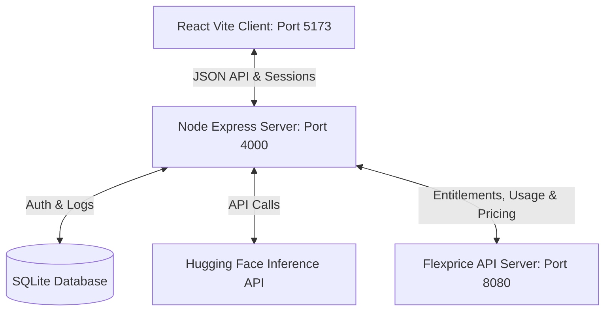

# TextFlow — Metered AI Text processing SaaS on Flexprice

TextFlow is an AI-powered text summarization and rewriting SaaS platform that demonstrates end-to-end metered billing, boolean feature gating, subscription lifecycles, and pricing models using **Flexprice**.

---

## 🏗️ Architecture Overview

The project is decoupled into a decoupled client-server architecture:



* **Frontend**: React (Vite SPA) styled with a sleek dark-mode dashboard, metered progress indicator bars, tone selectors, and checkout flows.
* **Backend**: Node.js + Express JSON API managing authentication, text processing pipelines, metered event ingestion, and billing upgrades.
* **Database**: SQLite (via `better-sqlite3`) for local auth hashes and operations logs.
* **Billing Engine**: Flexprice (running locally via Docker on `:8080`) serving as the single source of truth for all subscriptions, entitlements, usage thresholds, and pricing calculations.

---

## ⚙️ Setup & Installation Instructions

Follow these steps to run the complete stack on your machine:

### 1. Prerequisites
Ensure you have the following installed:
* **Node.js** (v18 or higher)
* **Docker & Docker Compose** (for running Flexprice)

---

### 2. Run the Flexprice Service
Flexprice must be active locally. In your repository root, run the Docker compose script:
```bash
# Navigate to the flexprice directory
cd flexprice

# Start the services (Kafka, Clickhouse, Postgres, Flexprice API)
docker-compose up -d
```
The Flexprice API server will boot up and listen on `http://localhost:8080`.

---

### 3. Seed Flexprice Billing Configuration
Before launching the applications, run the idempotent seeding script to configure the features, meters, plans, entitlements, and prices in Flexprice:
```bash
# Navigate to the server folder
cd textflow/server

# Install dependencies
npm install

# Run the seeding script
node scripts/seed-flexprice.js
```
This script configures:
1. **Metered Feature**: `Characters Processed` mapping to the `text_processed` event with `SUM(char_count)` aggregation.
2. **Boolean Feature**: `Tone Selector` (unlocked only on the Pro plan).
3. **Free Plan**: $0.00 base fee, 2,000 characters/month hard limit, Tone Selector disabled.
4. **Pro Plan (Model A)**: $9.00/month flat fee + $0.50 per 1,000 characters processed, 50,000 characters/month limit, Tone Selector enabled.
5. Writes the generated IDs directly to the backend `.env` configuration file.

---

### 4. Start the Application Servers

Start the Node backend:
```bash
# Inside textflow/server
npm run dev
# The server will start on port 4000
```

Start the React client:
```bash
# Navigate to the client folder
cd ../client

# Install dependencies
npm install

# Start the Vite development server
npm run dev
# The client will start on port 5173
```

Now, open your browser and navigate to **`http://localhost:5173`** to use the application!

---

## 🧪 Integration Test Suites

To verify individual components, the backend contains a collection of verification suites inside the `textflow/server/scripts` folder:

* **Connection test**: `node scripts/test-flexprice-connection.js`
* **Entitlements test**: `node scripts/test-entitlement-service.js`
* **AI Service test**: `node scripts/test-ai-service.js`
* **Text Processing Routes test**: `node scripts/test-text-processing-routes.js`
* **Billing Routes test**: `node scripts/test-billing-routes.js`
* **E2E Authentication test**: `node scripts/test-auth-flow.js`

To run all tests:
```bash
# Inside textflow/server
npm run test
```

---

## 📊 A/B Pricing Models Experiment & Simulation

To compare pricing strategies for our Pro plan, we modeled two pricing structures:
* **Pricing Model A (Package Pricing)**: A flat fee of **$9.00/month** plus a linear usage cost of **$0.50 per 1,000 characters** (using `divide_by: 1000` transform).
* **Pricing Model B (Tiered Slab Pricing)**: A flat fee of **$9.00/month** plus a tiered slab usage fee:
  * First 10,000 characters: **$0.0008 / char** (effective rate of $0.80 per 1k characters)
  * Next 20,000 characters (10k to 30k): **$0.0005 / char** (effective rate of $0.50 per 1k characters)
  * Characters above 30,000: **$0.0003 / char** (effective rate of $0.30 per 1k characters)

### Running the Simulation
We built a simulation script simulating 5 customers spread across light, medium, and heavy usage profiles generating usage bursts over the last 30 days.

To execute the simulation:
```bash
# Inside textflow/server
node scripts/simulate-pricing.js
```

### Simulation Results Example
```text
========================================================================
📊 PRICING EXPERIMENT RESULTS COMPARISON
========================================================================
Customer        Profile   Total Chars   Model A ($)   Model B ($)   Cheaper
------------------------------------------------------------------------
sim_light_1     light     4,734         $11.50        $12.79        Model A
sim_medium_1    medium    33,763        $26.00        $28.13        Model A
sim_heavy_1     heavy     168,822       $93.50        $68.65        Model B
sim_heavy_2     heavy     157,742       $88.00        $65.32        Model B
sim_medium_2    medium    33,102        $26.00        $27.93        Model A
========================================================================
```
The results are written locally to: `textflow/server/simulation-results.csv`.

---

## 📈 Economic Takeaways

The simulation highlights a classic pricing trade-off in SaaS billing:

1. **Light & Medium Users**: **Model A** is cheaper for light-to-medium users because the initial slab rate of Model B ($0.80 per 1,000 characters up to 10k) is relatively high. Model A offers them a linear, predictable $0.50 rate from the first character.
2. **Heavy Volume Users**: **Model B** is significantly cheaper for heavy users (e.g. over 150,000 characters). This is because the slab rate decreases to $0.30 per 1k characters for volume beyond 30,000, compounding massive savings at high scales.
3. **Product Strategy Recommendation**:
   * If the SaaS goal is **simplicity and predictability** for single users and developers, **Model A** is superior.
   * If the goal is **enterprise adoption, volume discounts, and churn mitigation for power users**, **Model B** is the clear winner, preventing power users from experiencing pricing shocks when scaling operations.
